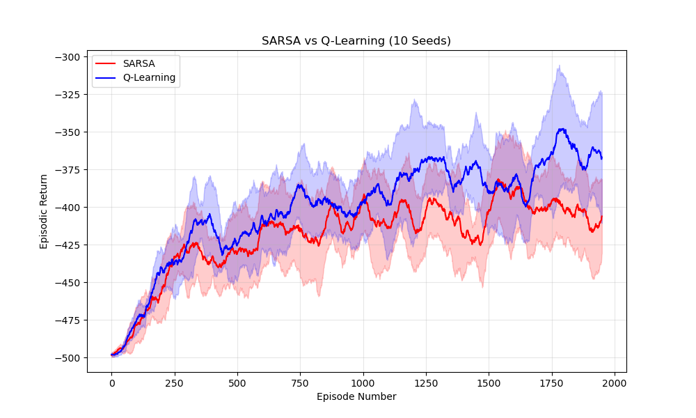
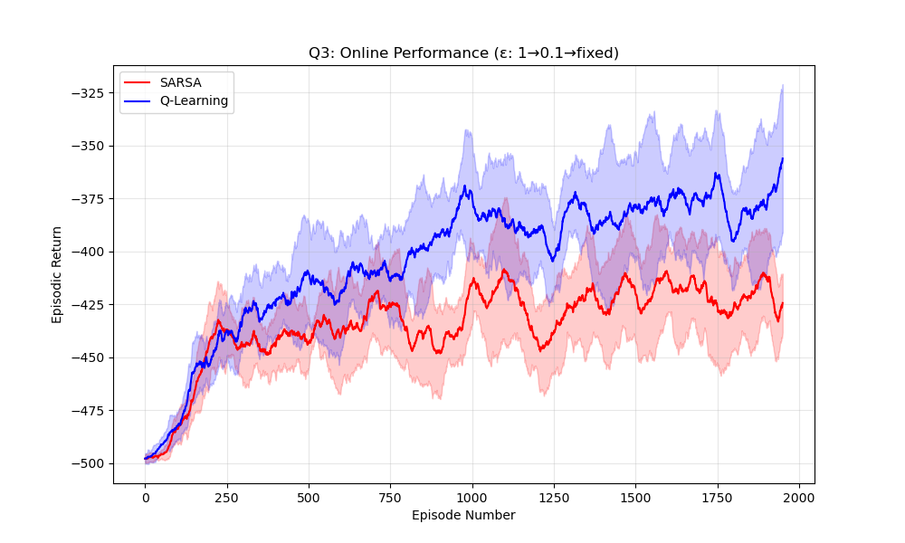
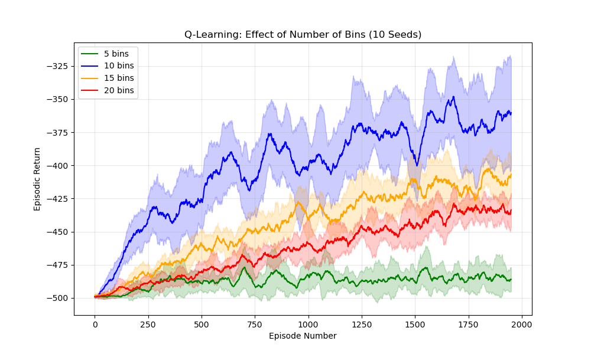

# Report - Programming Assignment 1

## Problem 1: MDP Simulation

**1. MDP Formulation:**
The problem is modeled as a Markov Decision Process defined by the tuple $\langle \mathcal{S}, \mathcal{A}, \mathcal{P}, \mathcal{R}, \gamma \rangle$.

- **State Space ($\mathcal{S}$):** The state is defined by the drone's position $(x, y)$ on the $5 \times 5$ grid and its water status $w \in \{0, 1\}$ (where $0$ is empty, $1$ is filled).
    $$\mathcal{S} = \{(x, y, w) \mid x, y \in \{0, 1, 2, 3, 4\}, w \in \{0, 1\}\}$$
    The state space is discrete and contains $|\mathcal{S}| = 5 \times 5 \times 2 = 50$ states. Terminal states are boulder cells $(2, 4, w)$ and $(3, 4, w)$, and the fire zone with water $(4, 4, 1)$.

- **Action Space ($\mathcal{A}$):** The discrete action space consists of five possible moves.
    $$\mathcal{A} = \{\text{North}, \text{South}, \text{East}, \text{West}, \text{Hover}\}$$

- **Transition Probabilities ($p(s' | s, a)$):** The probability of transitioning to state $s'$ given state $s$ and action $a$. Let $\Delta(a)$ be the intended movement direction and $\Delta(a_\perp)$ be the perpendicular directions.
  - *Normal cells:* $p(s+\Delta(a)|s,a) = 0.7$, $p(s+\Delta(a_\perp)|s,a) = 0.1$ each, $p(s|s,a) = 0.1$.
  - *Smoke cells:* $p(s+\Delta(a)|s,a) = 0.4$, $p(s+\Delta(a_\perp)|s,a) = 0.1$ each, $p(s|s,a) = 0.4$.
  - *Hover:* $p(s|s,\text{Hover}) = 1.0$.
  - *Water pickup:* Entering $(0,0)$ with $w=0$ deterministically transitions to $(0,0)$ with $w=1$.
  - *Boundaries:* Any transition leading off the grid results in remaining in the current cell.

- **Reward Function ($r(s, a, s')$):** The expected immediate reward on transition.
  - $r(s, a, s') = 100$ if $s' = (4, 4, 1)$ (Fire zone with water)
  - $r(s, a, s') = -100$ if $s' \in \{(2, 4, w), (3, 4, w)\}$ (Boulders)
  - $r(s, a, s') = -11$ if $s' \in \{(1, 2, w), (3, 2, w)\}$ (Smoke: $-1$ step penalty + $-10$ hazard)
  - $r(s, a, s') = -1$ otherwise (Standard step penalty)

- **Discount Factor ($\gamma$):** $\gamma = 0.95$

**2. Value Iteration and Optimal Policy:**
The optimal value function $v_*(s)$ is found by iteratively applying the Bellman Optimality Equation update rule:
$$V_{k+1}(s) = \max_a \sum_{s', r} p(s', r|s,a) [r + \gamma V_k(s')]$$

Once the values converge (i.e., the maximum change across all states is less than a small threshold $\theta$), the optimal deterministic policy $\pi_*(s)$ is extracted by acting greedily with respect to the optimal value function:
$$\pi_*(s) = \text{argmax}_a \sum_{s', r} p(s', r|s,a) [r + \gamma V_*(s')]$$

The required visualizations are present in the `outputs/` directory, for both phases (water_empty and water_filled).

**3. Modifying the Discount Factor ($\gamma = 0.3$):**

- **(a) What are the resulting optimal value function and policy? Explain the difference.**

The optimal value function drops drastically compared to $\gamma = 0.95$, with most states far from the goal evaluating to negative values (~ -1.4). A discount factor of $\gamma = 0.3$ makes the drone extremely myopic (short-sighted). The distant +100 reward is discounted so heavily that it cannot outweigh the immediate accumulation of -1 step penalties, causing the drone to abandon the main objective if it is too far away.

- **(b) What happens near the hazardous states when $\gamma = 0.3$? Can you explain the behavior?**

Near hazardous states, the drone adopts a purely evasive or stationary policy, such as moving away from the smoke or hovering. Because the drone is short-sighted, it prioritizes avoiding the massive immediate penalties of smoke (-11) or boulders (-100). It lacks the long-term incentive to risk the 10% chance that the wind will blow it into a hazard while trying to navigate past it.

- **(c) Is there any case in the two MDPs where the drone prefers doing nothing (hovering) despite the per-step penalty? Explain either ways.**

Yes. In the $\gamma = 0.3$ MDP, the drone chooses to hover in cells surrounded by hazards (e.g., cell `(2, 2)` between two smoke cells, or `(3, 3)` near smoke and a boulder). Hovering is deterministic and unaffected by wind. The myopic drone prefers the guaranteed -1 hover penalty over taking a directional step that carries a 10% risk of being blown into the boulder. The $\gamma = 0.95$ drone never hovers (except at the lake) since doing so delays reaching the +100 goal.

- **(d) Are there any interesting states where the drone behaves differently in the two MDPs? Explain.**

Cells `(1, 3)` and `(0, 2)` during both phases are prime examples. Considering phase 1 with $\gamma = 0.95$, the drone at `(1, 3)` moves North to route around the smoke and reach the lake efficiently. With $\gamma = 0.3$, the drone at `(1, 3)` moves East-actively running away from the adjacent smoke at `(1, 2)` and burying itself in the corner, completely abandoning the lake because immediate survival outweighs the heavily discounted goal. This "avoidance" behaviour is present at `(0, 2)` as well.

**4. Modifying Hazard Penalties and Wind Dynamics:**

- **(a) What are the resulting optimal value function and policy? Explain the difference (if any) in the solution due to changing the problem in the two MDPs. Focus on the regions near hazardous cells.**
The value function drops drastically around the smoke hazards at (1, 2) and (3, 2), reflecting extreme risk. The optimal policy becomes highly risk-averse; rather than skirting the hazards as in the base case, the policy routes the drone explicitly away from them to completely avoid the 10% risk of the wind pushing it into a -91 penalty.

- **(b) Is there a scenario where hovering may be preferred? Explain either ways.**
Yes. In the Empty Water phase, cell (3, 3) prefers Hovering, with a value of exactly -20.0. Because (3, 3) is bordered by smoke at (3, 2) and a boulder at (3, 4), any directional movement carries a 10% chance of a massive penalty. The expected return of moving drops below -20, making the infinite penalty of hovering (-1 / (1 - 0.95) = -20) the optimal choice.

- **(c) Is there a scenario when a longer path to the fire zone is preferable from a particular cell? Why or why not?**
Yes. If the drone starts at (4, 4) in the Empty Water phase, the shortest path is towards the center. However, the optimal policy routes it LEFT along the bottom row. Also, at cells like (4, 2), the policy is to move DOWN. The drone intentionally drives into the bottom wall so that the intended motion keeps it safely in place, allowing the perpendicular wind to push it left or right. This longer path eliminates the risk of being blown North into the smoke.

- **(d) Given the above MDP with the −90 hazard penalty and γ = 0.95, suppose the wind becomes stronger. As a result, in all non-terminal states, the drone moves in the intended direction with a 40% chance, in either of the perpendicular directions with a 25% chance, or stays in the same cell the rest of the time. Comment your thoughts on the solution to the resulting MDP.**
With the wind volatility increased to a 25% perpendicular push in each direction, the environment becomes too chaotic to navigate narrow safe corridors. The value function decreases grid-wide, with the drone abandoning the objective entirely from even more states (ex, cells (2, 2) and (3, 3) in both phases now default to a permanent Hover (value -20.0). The 25% risk of being blown into a hazard makes doing nothing the best choice).

## Problem 2: Gymnasium Acrobot Environment

**1. Discretization and State Space:**

The Acrobot-v1 environment has a continuous observation space [consisting of 6 dimensions](https://gymnasium.farama.org/environments/classic_control/acrobot/#observation-space): $[\cos(\theta_1), \sin(\theta_1), \cos(\theta_2), \sin(\theta_2), \dot{\theta}_1, \dot{\theta}_2]$.
By discretizing each of these 6 dimensions into $10$ bins, the state space becomes a 6-dimensional grid. The total number of states is therefore $10^6$.

**2. Hyperparameter Tuning and ε-Decay:**

*(a)* A grid search over step sizes $\alpha \in \{0.1, 0.3, 0.5\}$ and exploration rates $\epsilon \in \{0.05, 0.1, 0.3\}$ was conducted for 500 episodes, averaged over 3 runs. The top three configurations are reported below.

| Rank | Algorithm | $\alpha$ | $\epsilon$ | Mean Final Return |
| ---- | --------- | -------- | ---------- | ----------------- |
| 1    | SARSA     | 0.5      | 0.05       | -408.55           |
| 2    | SARSA     | 0.3      | 0.05       | -418.16           |
| 3    | SARSA     | 0.1      | 0.05       | -431.02           |

| Rank | Algorithm  | $\alpha$ | $\epsilon$ | Mean Final Return |
| ---- | ---------- | -------- | ---------- | ----------------- |
| 1    | Q-Learning | 0.3      | 0.1        | -397.19           |
| 2    | Q-Learning | 0.3      | 0.05       | -416.88           |
| 3    | Q-Learning | 0.5      | 0.1        | -424.31           |

A constant $\epsilon$ is **not sufficient** for good exploration. Early in training, the Q-table is uninformed and requires broad exploration; a fixed, small $\epsilon$ (e.g., 0.05) leads to premature exploitation of poor estimates. Empirically, decaying $\epsilon$ from 1.0 to 0.05 improves SARSA's final return from $-441.24$ to $-402.84$. An exponential decay schedule $\epsilon_t = \max(\epsilon_{\min},\ \epsilon_0 \cdot \lambda^t)$ with $\lambda = 0.99$ was adopted.

*(b)* The mean episodic return with $\pm 1$ standard deviation confidence bands over 10 seeds is shown below. Both algorithms use $\epsilon_0 = 1.0$, $\lambda = 0.99$, and their respective best $\alpha$ and $\epsilon_{\min}$.

Both algorithms improve monotonically from ~$-500$ at initialization. Q-Learning converges faster and to a better final policy (~$-360$) compared to SARSA (~$-410$) by episode 2000. Q-Learning's confidence interval is mostly wider, reflecting higher variance across seeds - a consequence of its off-policy updates, which are more sensitive to Q-table initialization. SARSA's on-policy updates are more conservative, yielding lower variance but slower improvement. Neither curve has fully plateaued at 2000 episodes, due to the large discrete state space ($10^6$ states) requiring extensive exploration.

**3. Online vs. Post-Learning Performance (ε: 1 → 0.1 → fixed):**

Both algorithms were trained with $\epsilon$ decaying from 1.0 to 0.1 ($\lambda = 0.99$, floor fixed at 0.1 thereafter), then evaluated greedily ($\epsilon = 0$) for 100 episodes per seed over 10 seeds.

| Algorithm  | Online Return (last 100 eps) | Greedy Post-Learning Return |
| ---------- | ---------------------------- | --------------------------- |
| SARSA      | ~$-425$                      | $-386.54 \pm 28.55$         |
| Q-Learning | ~$-360$                      | $-342.03 \pm 56.31$         |

*(i) Online performance:* Q-Learning outperforms SARSA throughout training for the same reasons as in Q2 - its off-policy max update more aggressively improves value estimates.

*(ii) Post-learning greedy evaluation:* Both algorithms improve noticeably when $\epsilon$ is set to 0. SARSA improves by ~$39$ points and Q-Learning by ~$33$ points. The improvement occurs because during online training, $\epsilon = 0.1$ results in 10% random actions, which occasionally lead to suboptimal transitions and depress the measured return. The greedy policy, free of this noise, executes the learned policy cleanly.

The improvement gap is slightly larger for SARSA. This is a direct consequence of its on-policy nature: SARSA's Q-values are trained to account for the $\epsilon$-greedy behavior policy (including random actions), so they are slightly pessimistic about purely greedy execution. Q-Learning's Q-values already target the greedy policy regardless of the behavior policy, so the gap between online and greedy performance is smaller.

**4. Effect of Number of Bins:**

Increasing bins improves state representation but expands the state space as $\text{bins}^6$, making thorough exploration harder within a fixed episode budget.

| Bins | State Space Size        | Mean Final Return (last 100 eps) |
| ---- | ----------------------- | -------------------------------- |
| 5    | $5^6 = 15{,}625$        | ~$-480$                          |
| 10   | $10^6 = 1{,}000{,}000$  | ~$-360$                          |
| 15   | $15^6 = 11{,}390{,}625$ | ~$-415$                          |
| 20   | $20^6 = 64{,}000{,}000$ | ~$-435$                          |

With 5 bins, the representation is too coarse - genuinely distinct states are collapsed into the same bin, making it impossible to distinguish situations requiring different actions. The agent barely learns.

With 10 bins, the granularity is sufficient for meaningful state differentiation, and the agent can visit each state often enough to build reliable Q-value estimates within 2000 episodes.

With 15 and 20 bins, performance paradoxically worsens. The state space grows combinatorially (the **curse of dimensionality**), meaning most states are never visited. Q-values for unvisited states remain close to their random initialization values, rendering the derived policy unreliable.

**5. Modified Reward Function Analysis:**

The modified reward is:
$$r = \frac{\eta h}{2} + \text{sign}(-1 + \eta h) \cdot \frac{2 - \eta h}{2}, \quad \eta > 0$$

This simplifies to the following piecewise function (substituting $x = \eta h$):
$$r = \begin{cases} \eta h - 1, & \text{if } \eta h < 1 \\ 1, & \text{if } \eta h \geq 1 \end{cases}$$

*(a)* The modified reward is [**dense**](https://ai.stackexchange.com/questions/23012/what-are-the-pros-and-cons-of-sparse-and-dense-rewards-in-reinforcement-learning) - it provides a continuous gradient proportional to height $h$ at every timestep, unlike the original sparse reward of $-1$ per step. This *should* result in faster learning, since the agent receives informative feedback on whether it is moving toward or away from the goal at every transition.

However, the $r = +1$ region (when $h \geq 1/\eta$) introduces the risk of **reward hacking**: the agent may learn to hover just above the threshold $h = 1/\eta$ indefinitely to collect positive per-step rewards, rather than swinging high enough to terminate the episode. This is an unintended, emergent behavior that diverges from the original task objective.

*(b)* With $\eta = 0.5$, the reward threshold is at $h = 1/0.5 = 2$, which is the physical maximum height achievable by the Acrobot. In practice, $\eta h < 1$ holds throughout the episode, so the reward is always $r = 0.5h - 1 \in [-2, 0]$. The reward is always non-positive and exhibits a clear upward gradient. There is no exploitable $+1$ plateau. This is the **safest setting** - it should result in **faster learning** than the original sparse reward, with no unexpected behavior.

*(c)* As $\eta$ increases, the threshold $h^* = 1/\eta$ decreases, making the positive reward region easier to reach:

- **$\eta = 1$:** Threshold $h^* = 1$. Since Acrobot's termination condition requires the tip to exceed approximately $h = 1$, the positive-reward region nearly coincides with the termination zone. The agent may marginally delay committing to a terminating swing, but the effect is mild.
- **$\eta = 2$:** Threshold $h^* = 0.5$. This is comfortably below the termination height. The agent is incentivized to stabilize near $h \approx 0.5$, learning a hovering policy rather than a solving policy.
- **$\eta = 5$:** Threshold $h^* = 0.2$. Trivially easy to reach from the resting position. The agent will almost certainly learn to hover just above $h = 0.2$ and collect $+1$ per step indefinitely - the episode may never terminate, effectively breaking the task.

**Recommended range:** $0 < \eta \leq 0.5$, which ensures $h^* \geq 2$ (the physical maximum), keeping the reward always non-positive and the positive-reward region physically unreachable. The dense gradient still accelerates learning without perverse incentives.

*(d)* This experiment yields several insights for reward function design:

- **Dense rewards accelerate learning** over sparse ones by providing gradient information at every step, but must be designed carefully.
- **Positive intermediate rewards are dangerous.** If a non-terminal state yields a positive reward, the agent may exploit it indefinitely rather than pursuing the true goal (reward hacking).
- **A well-designed reward should be (i) non-positive until the true goal is reached, (ii) provide a gradient toward the goal, and (iii) not incentivize avoiding episode termination.** The $\eta = 0.5$ case satisfies all three criteria and is the ideal setting.
- Reward shaping is a powerful tool, but the shaped reward must remain aligned with the original task's termination objective.
